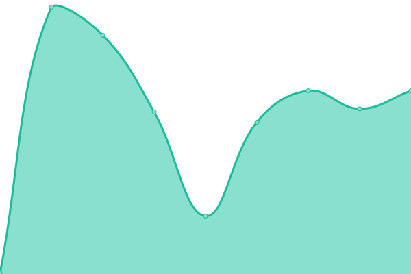
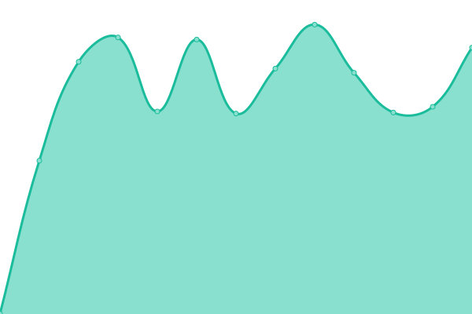
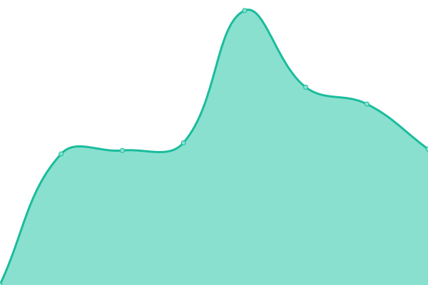
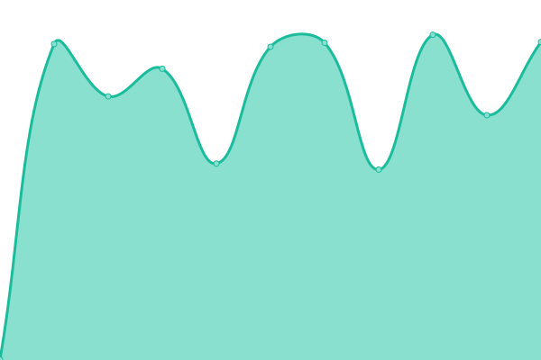
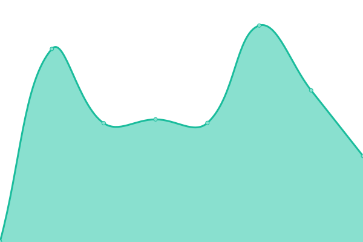

# [📈 Live Status](https://up.fruw.org): <!--live status--> **🟧 Partial outage**

This repository contains the open-source uptime monitor and status page for [Руслан](fruw.org), powered by [Upptime](https://github.com/upptime/upptime).

With [Upptime](https://upptime.js.org), you can get your own unlimited and free uptime monitor and status page, powered entirely by a GitHub repository. We use [Issues](https://github.com/fruworg/upptime/issues) as incident reports, [Actions](https://github.com/fruworg/upptime/actions) as uptime monitors, and [Pages](https://up.fruw.org) for the status page.

<!--start: status pages-->
<!-- This summary is generated by Upptime (https://github.com/upptime/upptime) -->
<!-- Do not edit this manually, your changes will be overwritten -->
<!-- prettier-ignore -->
| URL | Status | History | Response Time | Uptime |
| --- | ------ | ------- | ------------- | ------ |
|  [fruw.org](https://fruw.org) | Работает | [fruw-org.yml](https://github.com/fruworg/upptime/commits/HEAD/history/fruw-org.yml) | 

 229мс
     
 | 

<a href="https://up.fruw.org/history/fruw-org">100.00%</a>
    

|  [mail.fruw.org](https://mail.fruw.org) | Не работает | [mail-fruw-org.yml](https://github.com/fruworg/upptime/commits/HEAD/history/mail-fruw-org.yml) | 

 791мс
     
 | 

<a href="https://up.fruw.org/history/mail-fruw-org">100.00%</a>
    

|  [matrix.fruw.org](https://matrix.fruw.org) | Работает | [matrix-fruw-org.yml](https://github.com/fruworg/upptime/commits/HEAD/history/matrix-fruw-org.yml) | 

 572мс
     
 | 

<a href="https://up.fruw.org/history/matrix-fruw-org">100.00%</a>
    

|  [vault.fruw.org](https://vault.fruw.org) | Не работает | [vault-fruw-org.yml](https://github.com/fruworg/upptime/commits/HEAD/history/vault-fruw-org.yml) | 

 509мс
     
 | 

<a href="https://up.fruw.org/history/vault-fruw-org">99.89%</a>
    

|  [git.fruw.org](https://git.fruw.org) | Работает | [git-fruw-org.yml](https://github.com/fruworg/upptime/commits/HEAD/history/git-fruw-org.yml) | 

 658мс
     
 | 

<a href="https://up.fruw.org/history/git-fruw-org">100.00%</a>
    

|  [turn.fruw.org](https://turn.fruw.org) | Работает | [turn-fruw-org.yml](https://github.com/fruworg/upptime/commits/HEAD/history/turn-fruw-org.yml) | 

 481мс
     
 | 

<a href="https://up.fruw.org/history/turn-fruw-org">100.00%</a>
    

<!--end: status pages-->

[**Visit our status website →**](https://up.fruw.org)

## 📄 License

- Powered by: [Upptime](https://github.com/upptime/upptime)
- Code: [MIT](./LICENSE) © [Руслан](fruw.org)
- Data in the `./history` directory: [Open Database License](https://opendatacommons.org/licenses/odbl/1-0/)
