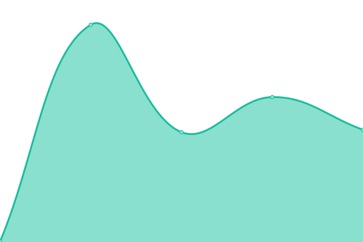
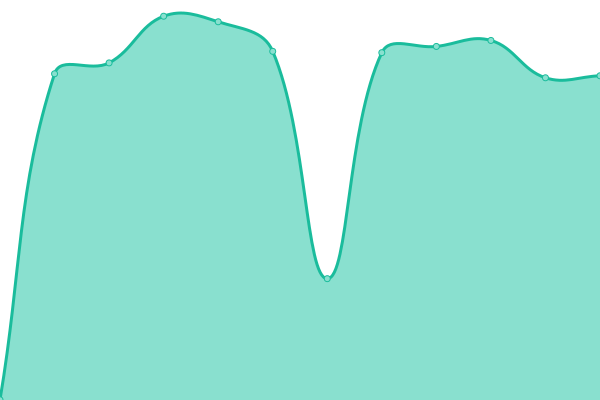
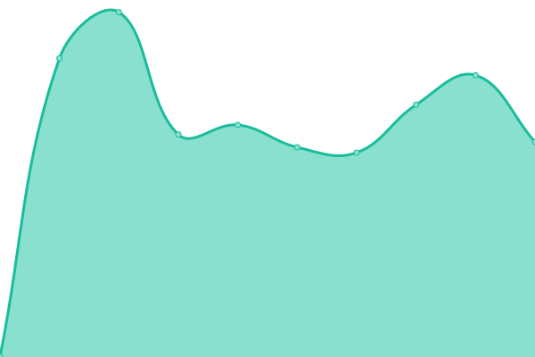

# [📈 Live Status](https://up.fruw.org): <!--live status--> **🟧 Partial outage**

This repository contains the open-source uptime monitor and status page for [Руслан](fruw.org), powered by [Upptime](https://github.com/upptime/upptime).

With [Upptime](https://upptime.js.org), you can get your own unlimited and free uptime monitor and status page, powered entirely by a GitHub repository. We use [Issues](https://github.com/fruworg/upptime/issues) as incident reports, [Actions](https://github.com/fruworg/upptime/actions) as uptime monitors, and [Pages](https://up.fruw.org) for the status page.

<!--start: status pages-->
<!-- This summary is generated by Upptime (https://github.com/upptime/upptime) -->
<!-- Do not edit this manually, your changes will be overwritten -->
<!-- prettier-ignore -->
| URL | Status | History | Response Time | Uptime |
| --- | ------ | ------- | ------------- | ------ |
|  [fruworg](https://fruw.org) | Работает | [fruworg.yml](https://github.com/fruworg/upptime/commits/HEAD/history/fruworg.yml) | 

 185мс
     
 | 

<a href="https://up.fruw.org/history/fruworg">100.00%</a>
    

|  [mail](https://mail.fruw.org) | Работает | [mail.yml](https://github.com/fruworg/upptime/commits/HEAD/history/mail.yml) | 

 747мс
     
 | 

<a href="https://up.fruw.org/history/mail">100.00%</a>
    

|  [matrix](https://matrix.fruw.org) | Работает | [matrix.yml](https://github.com/fruworg/upptime/commits/HEAD/history/matrix.yml) | 

 496мс
     
 | 

<a href="https://up.fruw.org/history/matrix">100.00%</a>
    

|  [vault](https://vault.fruw.org) | Работает | [vault.yml](https://github.com/fruworg/upptime/commits/HEAD/history/vault.yml) | 

 483мс
     
 | 

<a href="https://up.fruw.org/history/vault">100.00%</a>
    

|  [git](https://git.cock.li) | Не работает | [git.yml](https://github.com/fruworg/upptime/commits/HEAD/history/git.yml) | 

 0мс
     
 | 

<a href="https://up.fruw.org/history/git">23.30%</a>
    

|  [aeza](https://my.aeza.net) | Работает | [aeza.yml](https://github.com/fruworg/upptime/commits/HEAD/history/aeza.yml) | 

 1475мс
     
 | 

<a href="https://up.fruw.org/history/aeza">93.53%</a>
    

|  [riseup](https://mail.riseup.net) | Работает | [riseup.yml](https://github.com/fruworg/upptime/commits/HEAD/history/riseup.yml) | 

 398мс
     
 | 

<a href="https://up.fruw.org/history/riseup">100.00%</a>
    

|  [cock.li](https://mail.cock.li) | Работает | [cock-li.yml](https://github.com/fruworg/upptime/commits/HEAD/history/cock-li.yml) | 

 803мс
     
 | 

<a href="https://up.fruw.org/history/cock-li">100.00%</a>
    

<!--end: status pages-->

[**Visit our status website →**](https://up.fruw.org)

## 📄 License

- Powered by: [Upptime](https://github.com/upptime/upptime)
- Code: [MIT](./LICENSE) © [Руслан](fruw.org)
- Data in the `./history` directory: [Open Database License](https://opendatacommons.org/licenses/odbl/1-0/)
